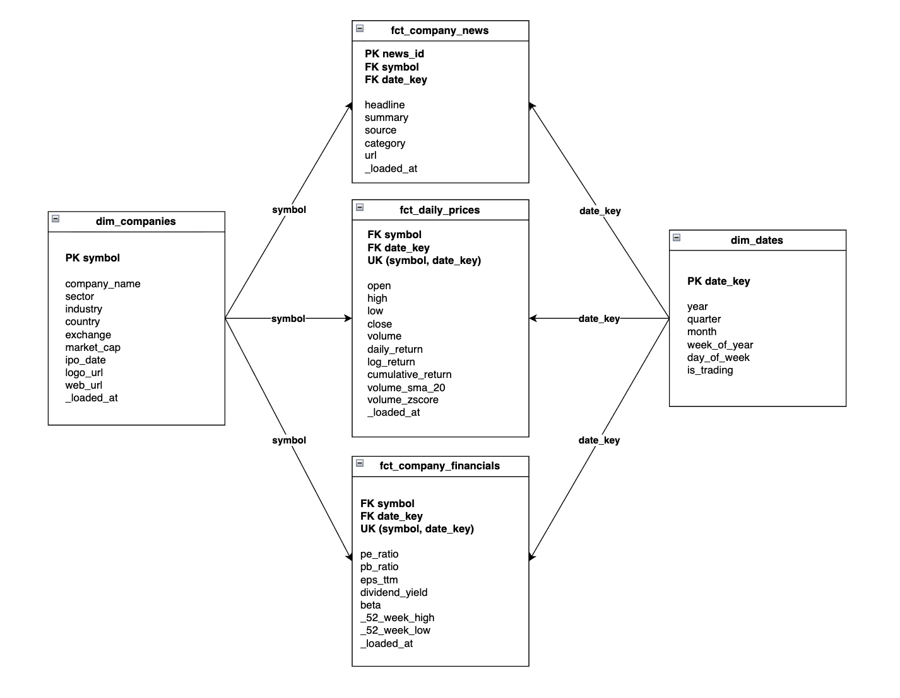
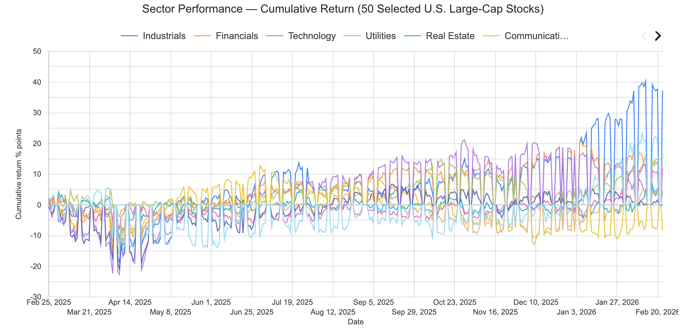
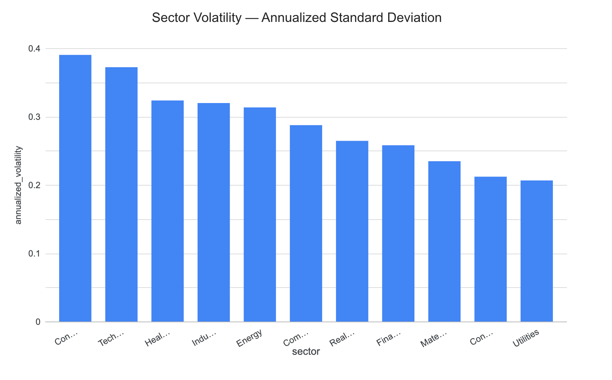

# Financial market analytics for 50 U.S. large-cap stocks


This is the final project for the Data Engineering Zoomcamp 2026 cohort. It is an open-source market analytics platform built on a curated universe of 50 U.S. large-cap stocks across 11 GICS sectors. The pipeline ingests market data into GCS, transforms it in BigQuery using dbt, and serves dashboards in Looker Studio.

The project is designed to answer practical market questions, such as which sectors have outperformed over the past 12 months and which sectors have been the most volatile. Data ingestion runs in batch mode and supports daily, weekly, and monthly execution. The pipeline also supports backfilling, making it possible to load historical data for any selected time period.


## Business Questions

1. Which sectors outperform over the last 12 months?
2. Which sectors are the most volatile?

## Repository Structure

```text
├── airflow/                           # Airflow orchestration and DAG definitions
├── dbt_finnhub/                       # dbt project for data transformation in BigQuery
├── docker-compose.yml                 # Local multi-service development environment
├── docs/                              # Project documentation and architecture assets
├── ingestion/                         # Data ingestion scripts and pipeline logic
├── Makefile                           # Command shortcuts for common project tasks
├── README.md                          # Main project documentation
└── terraform/                         # Infrastructure as Code for Google Cloud resources

```

## Architecture


This project is built as a `batch-oriented` market analytics platform on Google Cloud. Infrastructure is provisioned with Terraform, which creates the GCS bucket, BigQuery datasets, and required IAM resources.

Data is collected from the `Finnhub API`, with `yfinance` used as a fallback source for candle data when needed. The ingestion layer is implemented in Python and orchestrated by Airflow. Raw files are stored in GCS as Hive-partitioned Parquet files before being exposed in BigQuery through the raw layer.

Transformations are managed with dbt in BigQuery. The project follows a layered approach with staging, intermediate, mart, and metrics models. These models clean and standardize the raw data, compute derived indicators such as returns and volume statistics, and build analytics-ready fact tables, dimensions, and sector-level aggregates.


## Dimensional Model Design

### Star Schema



The central fact table is `fct_daily_prices`, linked to shared dimensions `dim_dates` and `dim_companies`.
Additional facts `fct_company_news` and `fct_company_financials` reuse the same dimensions for consistent filtering by date, symbol, and sector.

### dbt model DAG

```text
├── intermediate/                      # Intermediate transformation models
│   ├── _int__models.yml               # Intermediate model schema and tests
│   ├── int_daily_returns.sql          # Computes daily return metrics
│   └── int_volume_stats.sql           # Computes rolling volume statistics
├── marts/                             # Final analytics-ready dimensional models
│   ├── _mrt__models.yml               # Mart model schema and tests
│   ├── dim_companies.sql              # Company dimension
│   ├── dim_dates.sql                  # Date dimension
│   ├── fct_company_financials.sql     # Daily company market metrics
│   ├── fct_company_news.sql           # Company news events
│   └── fct_daily_prices.sql           # Daily stock price facts
├── metrics/                           # Reporting-focused aggregate models
│   ├── _metrics__models.yml           # Metric model schema and tests
│   ├── sector_performance.sql         # Sector performance analysis
│   └── sector_volatility.sql          # Sector volatility analysis
└── staging/                           # Source-aligned staging layer
    ├── _stg__models.yml               # Staging model schema and tests
    ├── _stg__sources.yml              # Source definitions
    ├── stg_candles.sql                # Raw market price staging
    ├── stg_company_financials.sql     # Raw financial data staging
    ├── stg_company_news.sql           # Raw news data staging
    └── stg_company_profiles.sql       # Raw company profile staging
```

### Data architecture

The project follows a `medallion-style` architecture across Google Cloud Storage (GCS) and BigQuery.

Raw source data is first ingested into GCS, then loaded into BigQuery, where dbt builds the Silver and Gold layers.

| Layer | Storage | BigQuery Dataset(s) | Purpose | Example Assets |
|-------|---------|----------------------|---------|----------------|
| Bronze | GCS + BigQuery | `finnhub_raw` | Stores raw data ingested from the source with minimal transformation. Raw files are first landed in GCS, then loaded into BigQuery raw tables. | GCS raw files, `raw_candles`, `raw_company_financials`, `raw_company_news`, `raw_company_profiles` |
| Silver | BigQuery | `finnhub_dw_stg`, `finnhub_dw_int`, `finnhub_dw_snap` | Cleans, standardizes, validates, and enriches source data through staging, intermediate models, and snapshots. | `stg_candles`, `stg_company_financials`, `stg_company_news`, `stg_company_profiles`, `int_daily_returns`, `int_volume_stats`, `snap_company_profiles` |
| Gold | BigQuery | `finnhub_dw_mart`, `finnhub_dw_metrics` | Provides analytics-ready dimensional models and aggregated datasets for BI and reporting. | `dim_companies`, `dim_dates`, `fct_daily_prices`, `fct_company_financials`, `fct_company_news`, `sector_performance`, `sector_volatility`, `monthly_top_worst_sector` |
| Reference | BigQuery | `finnhub_dw_seed` | Stores static reference data used to enrich transformation and reporting models. | `sector_mapping` |

### Partitioning and Clustering Strategy

To optimize query performance and control scan costs in BigQuery, the mart layer uses a time-based partitioning strategy combined with business-oriented clustering on the largest fact tables.

**Partitioning**

All high-volume fact tables are partitioned on `date_key` to limit the amount of data scanned during time-based analysis:

- `fct_daily_prices`: partitioned by day
- `fct_company_news`: partitioned by day
- `fct_company_financials`: partitioned by month

Daily partitioning is used for market prices and news because these datasets are queried at fine time granularity. Monthly partitioning is used for financial snapshots because the data changes less frequently and does not require daily partitions.

**Clustering**

Within each partition, tables are clustered by the most common analytical dimensions:

- `fct_daily_prices`: clustered by `symbol`, `sector`
- `fct_company_news`: clustered by `symbol`, `source`
- `fct_company_financials`: clustered by `symbol`

This improves performance for queries filtering or aggregating by ticker, sector, or news source, which are the main access patterns in the project.

**Design Rationale**

This strategy is designed to support two goals:

1. Reduce storage scan volume by pruning partitions with date filters.
2. Improve read efficiency inside each partition by colocating rows that are frequently queried together.

In practice, this makes the warehouse efficient for common use cases such as:
- analyzing price history over a date range,
- computing sector-level performance metrics,
- retrieving company news for a given symbol and period,
- comparing financial indicators across companies.

**Scope**

Partitioning and clustering are applied only to mart-level fact tables. Staging, intermediate, and dimension models are kept simpler because they are either smaller, reused as transformation layers, or not queried at the same scale as analytical fact tables.


## Quick Start (Bring Your Own Credentials)

**Each contributor must use their own cloud project, API key, and local config.**

## 1. Prerequisites

- Docker + Docker Compose plugin
- Google Cloud project: `your_gcp_project`
- BigQuery location: `your_bq_location`
- Local ADC auth: `your_gcloud_auth`
- Finnhub API key

### 1) Copy templates

```bash
cp .env.docker.example .env.docker
cp terraform/terraform.tfvars.example terraform/terraform.tfvars
mkdir -p ~/.dbt
cp dbt_finnhub/profiles.yml.example ~/.dbt/profiles.yml
```

### 2) Replace values with your own

- `.env.docker`
  - `GCP_PROJECT_ID`
  - `GCS_BUCKET`
  - `BQ_LOCATION`
  - `FINNHUB_API_KEY`
  - optional: `GOOGLE_APPLICATION_CREDENTIALS`
- `terraform/terraform.tfvars`
  - `project_id`
  - `bucket_name`
  - `region` / `location`
  - `labels.owner`
- `~/.dbt/profiles.yml`
  - `project`
  - `dataset`
  - `location`
  - `method` (`oauth` locally, or `service-account` in CI)

### 3) Authenticate against your GCP project

```bash
gcloud config set project <YOUR_GCP_PROJECT_ID>
gcloud auth application-default login
```

### 4) Quick sanity check

```bash
make docker-config
```

If placeholders such as `replace_me` are still present, do not run ingestion yet.

### Security rules

- Never commit `.env.docker`, `terraform.tfvars`, or service account keys.
- Keep secrets in local files or GitHub Secrets only.
- Commit only `*.example` templates.

## 2. Docker Quickstart (Recommended)

### 1) Configure environment

```bash
cp .env.docker.example .env.docker
# edit .env.docker: FINNHUB_API_KEY, GCP_PROJECT_ID, GCS_BUCKET, etc.
```

### 2) Validate and build containers

```bash
make docker-config
make docker-build
```

### 3) Start Airflow stack

```bash
make docker-up-airflow
```

Airflow UI: `http://localhost:8080`  
Default credentials from `.env.docker`: `airflow / airflow`

### 4) Run ingestion jobs in containers

```bash
make docker-ingestion-backfill AS_OF=2026-02-23
make docker-ingestion-daily
make docker-ingestion-weekly-news
make docker-ingestion-monthly
```

### 5) Create external raw tables in BigQuery

```bash
make docker-bq-external-tables BQ_PROJECT=seismic-ground-488312-u6 BQ_LOCATION=europe-west9
```

### 6) Run dbt in container

```bash
make docker-dbt-deps
make docker-dbt-seed
make docker-dbt-freshness
make docker-dbt-build
```

### 7) (Optional) Run Terraform in container

```bash
make docker-terraform-init
make docker-terraform-plan
# make docker-terraform-apply
```

### 8) Stop stack

```bash
make docker-down
# optional hard reset (removes postgres volume)
# make docker-reset
```

## Local (non-Docker) Workflow

You can still run the existing local workflow with `uv`, `dbt`, `bq`, and `terraform`.
Run `make help` for both local and Docker targets.

## Looker Studio Sources

- `your_gcp_project_id.finnhub_dw_metrics.sector_performance`
- `your_gcp_project_id.finnhub_dw_metrics.sector_volatility`
- `your_gcp_project_id.finnhub_dw_mart.fct_daily_prices`
- `your_gcp_project_id.finnhub_dw_metrics.monthly_top_worst_sector`

## Limits / Design Decisions

- Universe is a curated sample of 50 stocks (not top-50 dynamic ranking).
- Some Finnhub keys cannot access `stock/candle`, ingestion auto-falls back to `yfinance`.
- Data quality for news/fundamentals depends on API coverage.
- Region is pinned to `europe-west9` for reproducibility.

## CI/CD (GitHub Actions)

`/.github/workflows/ci.yml`:
- Trigger: `pull_request` + `push` on `main`
- `lint`: `ruff check ingestion/src airflow/dags`
- `smoke-tests`: install ingestion deps, `compileall`, run unit tests if present
- `dbt-parse`: `dbt deps` + `dbt parse`

`/.github/workflows/cd-terraform.yml`:
- Trigger: PR/push on `terraform/**` + manual `workflow_dispatch`
- Auth: GCP Workload Identity Federation (OIDC)
- Steps: `terraform fmt -check`, `init`, `validate`, `plan`
- Apply: manual only (`workflow_dispatch` with `apply=true`)

GitHub repository settings required for CI/CD:
- Variables: `GCP_PROJECT_ID`, `GCS_BUCKET` (optional: `GCP_REGION`, `BQ_LOCATION`, `ENVIRONMENT`)
- Secrets: `GCP_WORKLOAD_IDENTITY_PROVIDER`, `GCP_SERVICE_ACCOUNT`

## Current Outputs

- Sector cumulative return time series
  
- Sector annualized volatility ranking
  

